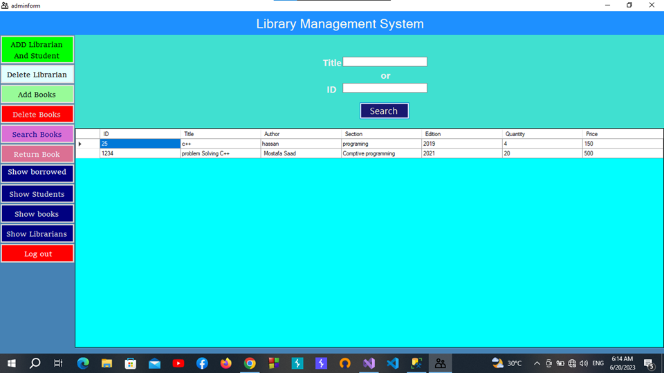
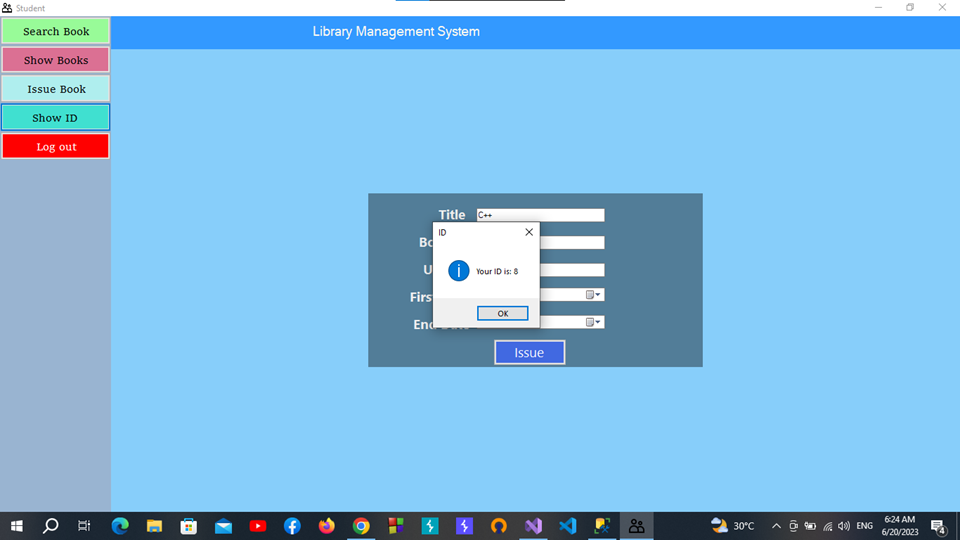

# Library Management System

It is a Desktop application (Library Management System) that is designed to help libraries to manage all processes efficiently. There are many problems that face librarians such as It is difficult for them to access books quickly, to know who borrowed books, and to know the quantity and location of books. our software solve all these problems and help Student to search for any book, issue books ,show all books in library and help The librarian to Add or Delete books, Return books and help Admin to Add or Remove librarian and Student , .

We Used Technologies:
- C# . Net ( Desktop application )
- Windows Form
- SQL Server (DBMS)

  
Presentation

  
  
  
  
  
  
  
  
  
  
  
  
  
  
  
  
  
  
  
  
  
  
  
  
  
  

